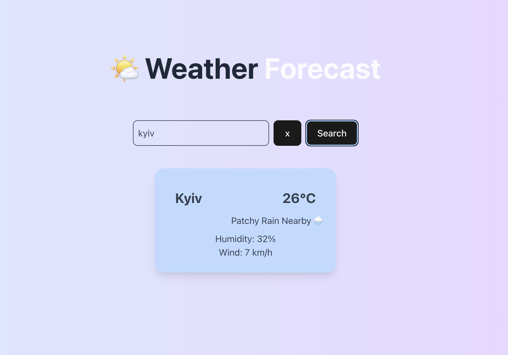

# 🌤️ Weather Forecast App

A simple React + TypeScript web app to fetch and display the current weather for any city in English.

The app uses [wttr.in](https://github.com/chubin/wttr.in) API (free, no API key required) and caches results for 10 minutes to reduce repeated requests.

## Demo
[DEMO link](https://test-task-weather-forecast.netlify.app/)

## Features
- Search for weather by city name

- Display:

- City name

- Temperature (°C)

- Weather description

- Humidity (%)

- Wind speed (km/h)

- Emoji based on weather

- Loader animation while fetching data

- Caching for 10 minutes per city

Responsive and styled using Tailwind CSS v4

## Preview

